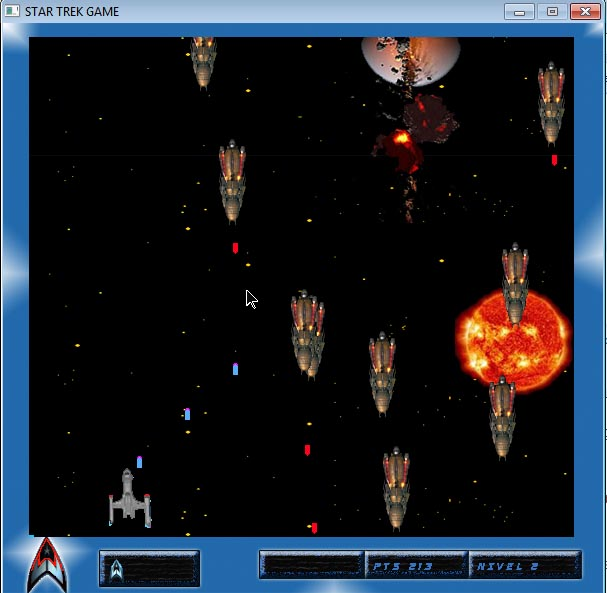
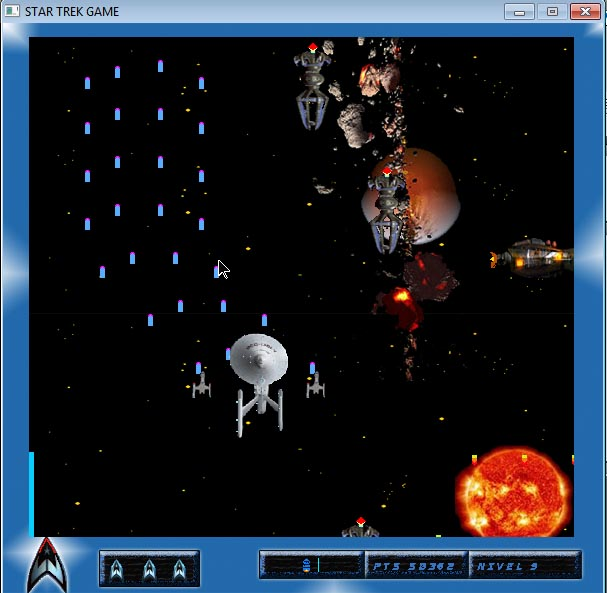
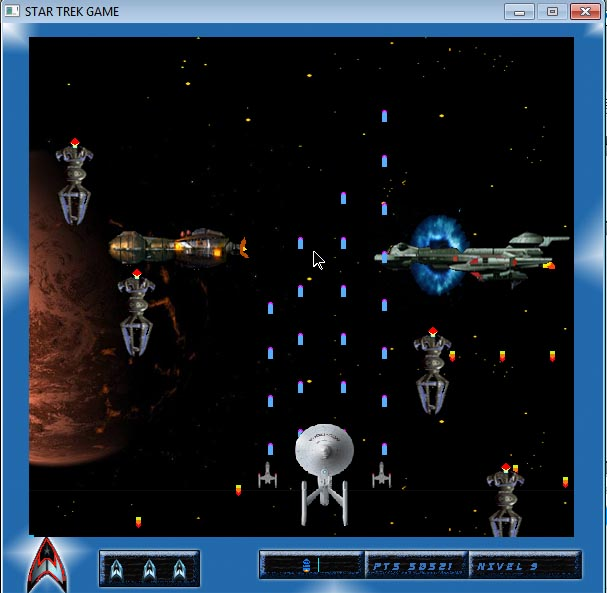

# StarTrek Game 

El juego StarTrek Game funciona solo en Windows,  
esta programado en C++ usando la libreria
allegro.h 

## Instalacion 

Para instalar el juego, debes dirigirte a [/bin/EVER_GAMES.exe](/bin/EVER_GAMES.exe)
Luego lo ejecutas y se inicia el instalador. Solo sige las instrucciones del mismo 
Una vez instalado ejecutalo en el acceso directo que sera creado en tu escritorio

### Requerimientos:

Windowss xp, Windows vista o Windows 7

### Requerimiento de Desarrollo:

CodeBlocks *
Allegro 4  *
allegttf   *
[iostream_alleg](https://github.com/ever23/iostream_alleg)
